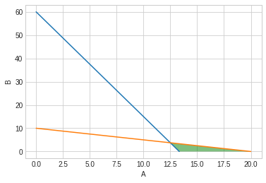
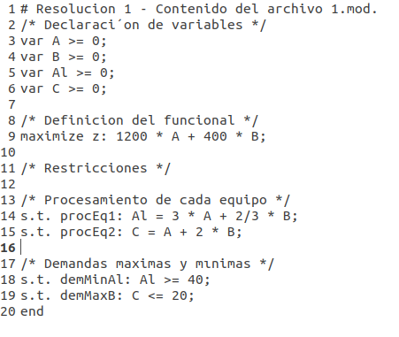
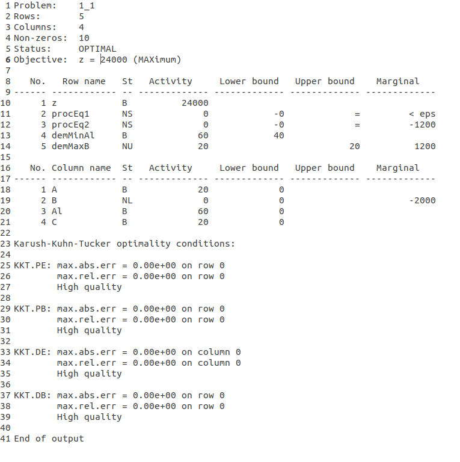

## 1.1
---

### Hipotesis:
1. Tengo disponibilidad infinita de los recursos.
2. Vendo todo lo que fabrico
3. Las fracciones de productos se venden a un precio porporcional al de la unidad
4. La disponibilidad del ciclohexano es máxima

### Periodo de tiempo:
Un mes.

### Variables:
$$Al(m^3/mes)$$: cantidad de $$m^3$$ de alcohol consumidos en el $$mes$$
$$Ch(tn/mes)$$: cantidad de $$tn$$ de alcohol consumidos en el $$mes$$ 

$$A(u/mes)$$: cantidad de $$unidades$$ de $$A$$ producidas en un $$mes$$
$$B(u/mes)$$: cantidad de $$unidades$$ de $$B$$ producidas en un $$mes$$

### Objetivo:
$$Z($) = max(1.200($/mes) * A(u/mes) + 400($/mes) * B(u/mes))$$

### Relaciones de variables:
1. $$Al(m^3/mes) = A(u/mes) * 3(m^3/u) + \frac{2}{3} (m^3/u) * B(u/mes)$$
2. $$Ch(tn/mes) = A(u/mes) * 1(tn/u) + 2 (tn/u) * B(u/mes)$$

### Restricciones:
1. Se debe consumir más de $$40(m^3/mes)$$ de alcohol ($$Al$$):
    $$Al(m^3/mes) \geq 40(m^3/mes)$$

2. DIsponibilidad del ciclohexano ($$Cl$$): $$20(tn/mes)$$
    $$Cl(tn/mes) \leq 20(m^3/mes)$$

### Modelo de programación lineal:
1. $$A(u/mes) * 3(m^3/u) + \frac{2}{3} (m^3/u) * B(u/mes) \geq 40(m^3/mes)$$
2. $$A(u/mes) * 1(tn/u) + 2 (tn/u) * B(u/mes) \leq 20(m^3/mes)$$

### Resolución gráfica

**Puntos posibles:**

| A  | B  | Func Obj (Z) |
|:--:|:--:|:------------:|
|12.5|3.75|    16500     |
|40/3| 0  |    16000     |
| 20 | 0  |    24000     |
 
**Solución óptima:**
Fabricar $$20 unidades$$ del producto A y $$0 u$$ del producto B. 
Para ello se deberá adquirir $$60m^2/mes$$ de alcohol y $$20tn/mes$$ de ciclohexano

### Resolución por software:

