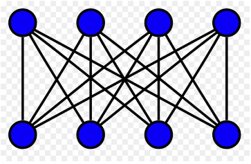

## Enunciado provisto

_Debido a las recurrentes quejas de los votantes por las distancias que deben recorrer desde sus domicilios hasta los lugares de votación, la Dirección Nacional Electoral desea rever la forma en que se asignan los ciudadanos a las mesas de votación. Se realizará una prueba piloto en un circuito electoral de la Ciudad de Buenos Aires._

## Análisis de la situación problemática

A modo de simplificación el modelo se limitará a asignar cada votante a un cupo de un centro de votación ya que una vez realizada esta tarea la división de votantes en mesas dentro de cada centro es trivial. El enfoque a seguir asigna votantes a centros de votación, es decir, a cada centro se le asignan los `n` votantes (siendo `n` la disponibilidad máxima del centro) más cercanos a él. De esta forma se asegura que cada votante se asigne al centro más cercano si es que el mismo no llenó su cupo con votantes aún más cercanos al mismo.

El tipo de problema detectado es de asignación ya que consiste en encontrar la forma de asignar ciertos recursos disponibles (votantes) para la realización de determinadas tareas al menor costo (distancia de cada votante al centro de votación). Se puede pensar en forma gráfica como un grafo bipartito, expuesto en la _Figura 1_, en el que los puntos superiores serían los votantes y los inferiores los cupos asignados en los centros de votación.

{ width=300px }

## Objetivo

Determinar los votantes que votarán en cada centro de votación de manera de minimizar la distancia de los centros de votación a su votante más lejano durante el día de elecciones.

## Hipótesis y Supuestos

- La votación debe realizarse en un único día para asegurar la transparencia electoral, por lo que la disponibilidad por centro es máxima y no puede reutilizarse.
- No hay restricciones respecto al tiempo que tarda un votante en ir al centro de votación o en votar.
- No hay restricciones respecto a la distancia máxima que debe recorrer un votante en tanto cada circuito electoral tiene distinta área por la densidad demográfica de la región. 
- Se conoce la distancia de cada votante a todos los centros de votación.
- Los votantes tomarán el camino que consideren más corto para ir a votar.
- Los votantes conocerán el camino más corto a su respectivo centro de votación.
- Hay suficiente capacidad entre todos los centros dentro del circuito para recibir a todos los votantes de dicho circuito.
- El domicilio registrado de los votantes se mantiene por todo el proceso electoral.
- Cada persona se encuentra en su domicilio legal al momento de salir hacia su centro de votación asignado.
- La vuelta a casa del votante no es tenida en cuenta en el modelo planteado.
- Se cuenta con medios mecánicos para que las personas discapacitadas puedan subir a un posible primer piso. 
- Hay libertad de asignar cualquier apellido a cualquier centro de votación. No es necesario mantener el _status quo_.
- Los votantes se mueven desde la puerta de su domicilio hasta la puerta del centro de votación sin ningún desvío. No se pueden tomar un colectivo que los deje a 2 cuadras.
- Cada votante se asigna a un único centro de votación (ocupa un único cupo).
- Los cupos de votantes no son reutilizables.
- Todo votante deberá ser asignado a un centro de votación. 
- Las elecciones son obligatorias.
- Los centros de votación no tienen demanda mínima. 
- Podrá abrirse un centro para sólo una persona.
- No hay restricciones respecto al presupuesto asignado a la votación.
- No hay restricciones respecto al costo de traslado de un votante al centro de votación.
- Todos los centros cuentan con una disponibilidad máxima. 
- Los presidentes de mesa o fiscales disponibles son infinitos en tanto se puede convocar a cualquier ciudadano por ley. El único limitante es la capacidad máxima del establecimiento. 
- Los votantes siempre tendrán un medio de transporte para ir a votar.
- Todos los votantes tienen la misma dificultad en recorrer la misma distancia. Por ejemplo: a un ciudadano A le es igual de difícil recorrer n metros que a ciudadano B, sin importar el valor de n.
- Se consideran votantes a las personas de 16 a 18 años empadronadas y a todos los mayores de 18.

## Esbozo de Variables del Modelo

- **Parámetros**

$D{i}{j}$ = distancia de cada votante al centro al que se asocia el cupo asignado $[m]$

$C{k}$ = capacidad máxima de cupos del centro `k` $[votante/centro]$

$V$ = cantidad de votantes $[votante]$

$C$ = cantidad de centros $[centro]$

- **Variables**

$X{i}{j} = 1$ si el votante `i` es asignado al cupo `j`

$X{i}{j} = 0$ si el votante `i` no es asignado al cupo `j`