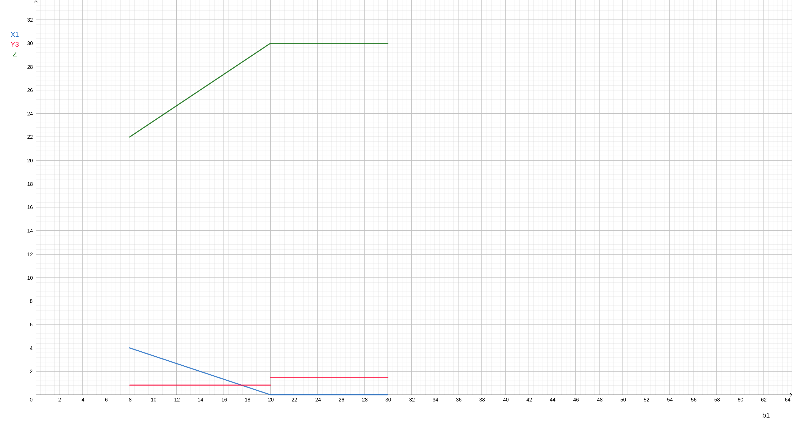

Dados el enunciado de un problema de Programacion Lineal y las tablas inicial y final de su resolucion por el metodo Simplex, se pide:

- ¿Qué utilidad unitaria mínima deberá tener un producto P7 para que sea conveniente producirlo, sabiendo que por unidad requiere 2 kg de materia prima y 3 horas de máquina? Detallar los cálculos.

Para hallar la utilidad unitaria mínima del producto P7 inicialmente se hace una estimación por el método del Lucro Cesante.

$$Lucro cesante = \sum UsoRecurso_{i} . ValorMarginalRecurso_{i}$$

$$ Lucro cesante = 2 \frac{kg}{u} \frac{2}{3} \frac{\$}{kg} + 3 \frac{hs}{u} \frac{5}{6}\frac{\$}{kg}$$

$$ Lucro cesante = \frac{23}{6} \frac{\$}{u}$$

Esto quiere decir que la utilidad utilitaria mínima que debe tener el producto P7 debe ser mayor o igual al lucro cesante, pero no precisamente igual al mismo ya que es solo una estimación.

Para hallar el verdadero valor se debe incoporarlo a la tabla óptima del problema. Esto se hace obteniendo una matriz de cambio de base y premultiplicando el vector nuevo por la misma para obtenerlo en la tabla óptima.

Matriz de cambio de base

$$
\left(\begin{array}{ccc} 
-1/3 & 0 & 1/3\\
2/3 & 0 & -1/6\\
2/3 & -1 & -1/6\\
\end{array}\right)
\left(\begin{array}{c} 
2\\ 
0\\
3
\end{array}\right) = \left(\begin{array}{c} 
1/3\\ 
5/6\\
5/6
\end{array}\right)
$$ 

Se procede a calcular el $z_{j} - c_{j}$ y se dice que debe ser $\leq$ 0 ya que se trata de un problema de maximización y para que convenga fabricarlo debe entrar a la base.

$$ 4\frac{1}{3} + 3 \frac{5}{6} + 0 \frac{5}{6} - C_{7} \leq 0 $$

Entonces $$C_{7} \geq \frac{23}{6}$$

El producto P7 debe tener una utilidad utilitaria mínima de 23/6 para que sea conveniente producirlo.

\newpage

- Graficar la variación de la cantidad de producto 1, del valor marginal del recurso hs. de máquina y del funcional, al variar la disponibilidad de materia prima entre 8 y 30 kg. por día. Indicar el valor de las pendientes señalando en qué parte de la tabla se encuentran._

En un primer lugar, es pertinente aclarar que la cantidad de producto 1 es $X_1$, el valor marginal del recurso hs. de máquina es $Y_3$ y el funcional es $Z$.

{ width=650px }

La explicación del gráfico se deriva del análisis de la tabla óptima del problema directo, del dual y de las corridas realizadas en el programa LINDO.

Se procede a correr el modelo planteado con el programa para poder obtener el rango de variación de la disponibilidad de materia prima en la tabla óptima dada.

```
!Funcional
MAX 4X1 + 3X2 + 2X3
ST
!Restriccion disponibilidad materia prima
MPRIMA) X1 + 2X2 + X3 < 10

!Restriccion disponiblidad horas maquina
HSMAQ) 4X1 + 2X2 + 2X3 < 20

!Cumplimiento demanda minima
DEMMIN) X2 > 2
END
```

\newpage 

La salida obtenida es:

``` 

 LP OPTIMUM FOUND AT STEP      1

        OBJECTIVE FUNCTION VALUE

        1)      23.33333

  VARIABLE        VALUE          REDUCED COST
        X1         3.333333          0.000000
        X2         3.333333          0.000000
        X3         0.000000          0.333333


       ROW   SLACK OR SURPLUS     DUAL PRICES
   MPRIMA)         0.000000          0.666667
    HSMAQ)         0.000000          0.833333
   DEMMIN)         1.333333          0.000000

 NO. ITERATIONS=       1


 RANGES IN WHICH THE BASIS IS UNCHANGED:

                           OBJ COEFFICIENT RANGES
 VARIABLE         CURRENT        ALLOWABLE        ALLOWABLE
                   COEF          INCREASE         DECREASE
       X1        4.000000         2.000000         1.000000
       X2        3.000000         5.000000         1.000000
       X3        2.000000         0.333333         INFINITY

                           RIGHTHAND SIDE RANGES
      ROW         CURRENT        ALLOWABLE        ALLOWABLE
                    RHS          INCREASE         DECREASE
   MPRIMA       10.000000         9.999999         2.000000
    HSMAQ       20.000000         8.000000         9.999999
   DEMMIN        2.000000         1.333333         INFINITY
``` 

Esta salida muestra que cuando la disponibilidad del recurso materia prima es de 10 kg, el valor de $X_1$ es de 10/3, el de $Y_3$ es 5/6 (se deduce de la columna dual prices y la fila HSMAQ) y el del funcional de 70/3. Ahora se debe analizar el rango de variación de la disponibilidad de materia prima, que resulta ser entre 8 y 20, ya que en la parte de la salida que dice RIGHTHAND SIDE RANGES se observa que el valor actual del coeficiente MPRIMA es 10 y se permite bajar hasta 2 unidades y subir hasta 10.

En este rango el valor de $Y_3$ permanece constante en su valor de 5/6 ya que al variar la disponibilidad de materia prima en el rango indicado no se modifica el valor marginal del recurso hs. de máquina. El funcional en cambio se trata de la recta $\frac{2}{3} b_1 + \frac{50}{3}$ y esto se deduce de la tabla óptima del dual.

| Bk | Yk | Ck | A1 | A2 | A3 | A4 | A5 | A6 | 
| ----------- | ----------- | ----------- | ----------- | ----------- | ----------- | ----------- | ----------- | ----------- |
| 0 | Y6 | 1/3 | 0 | - 1/3| 0 | -1/3 | -1/3 | 1 | 
| **b1** | Y1 | **2/3** | 1 | - 2/3 | 0 | 1/3 | -2/3 | 0 |
| **20** | Y3 | **5/6** | 0 | 1/6 | 1 | -1/3 | 1/6 | 0 | 
| Z = 2/3 b1 + 50/3 |  |  | 0 | -2/3 b1 + 16/3 | 0 | b1/3 - 20/3 | -2/3 b1 + 10/3 | 0 | 

El valor de $X_1$ en este rango se obtiene a partir de la recta $-\frac{1}{3} b_1 + \frac{20}{3}$ y esto también se deduce de la tabla óptima del dual.

| Bk | Yk | Ck | A1 | A2 | A3 | A4 | A5 | A6 | 
| ----------- | ----------- | ----------- | ----------- | ----------- | ----------- | ----------- | ----------- | ----------- |
| **0** | Y6 | 1/3 | 0 | - 1/3| 0 | **-1/3** | -1/3 | 1 | 
| **b1** | Y1 | 2/3 | 1 | - 2/3 | 0 | **1/3** | -2/3 | 0 |
| **20** | Y3 | 5/6 | 0 | 1/6 | 1 | **-1/3** | 1/6 | 0 | 
| Z = 2/3 b1 + 50/3 |  |  | 0 | -2/3 b1 + 16/3 | 0 | **b1/3 - 20/3** | -2/3 b1 + 10/3 | 0 | 

Se debe tener en cuenta que dentro de la tabla del dual los valores están intercambiados de signo.

Para seguir con el análisis de estas variables en el rango en el que la disponibilidad de materia prima varía entre 20 y 30 kg, se corre nuevamente el modelo en LINDO, modificando el valor de 10 por 20:

``` 
!Funcional
MAX 4X1 + 3X2 + 2X3
ST
!Restriccion disponibilidad materia prima
MPRIMA) X1 + 2X2 + X3 < 20.000001

!Restriccion disponiblidad horas maquina
HSMAQ) 4X1 + 2X2 + 2X3 < 20

!Cumplimiento demanda minima
DEMMIN) X2 > 2
END
```

La salida obtenida es:
```

 LP OPTIMUM FOUND AT STEP      0

        OBJECTIVE FUNCTION VALUE

        1)      30.00000

  VARIABLE        VALUE          REDUCED COST
        X1         0.000000          2.000000
        X2        10.000000          0.000000
        X3         0.000000          1.000000


       ROW   SLACK OR SURPLUS     DUAL PRICES
   MPRIMA)         0.000000          0.000000
    HSMAQ)         0.000000          1.500000
   DEMMIN)         8.000000          0.000000

 NO. ITERATIONS=       0


 RANGES IN WHICH THE BASIS IS UNCHANGED:

                           OBJ COEFFICIENT RANGES
 VARIABLE         CURRENT        ALLOWABLE        ALLOWABLE
                   COEF          INCREASE         DECREASE
       X1        4.000000         2.000000         INFINITY
       X2        3.000000         INFINITY         1.000000
       X3        2.000000         1.000000         INFINITY

                           RIGHTHAND SIDE RANGES
      ROW         CURRENT        ALLOWABLE        ALLOWABLE
                    RHS          INCREASE         DECREASE
   MPRIMA       20.000002         INFINITY         0.000000
    HSMAQ       20.000000         0.000000        16.000000
   DEMMIN        2.000000         8.000000         INFINITY
```

Esta salida muestra que cuando la disponibilidad del recurso materia prima es de 10 kg, el valor de $X_1$ es de 0, el de $Y_3$ es 3/2 (se deduce de la columna dual prices y la fila HSMAQ) y el del funcional de 30. Ahora se debe analizar el rango de variación de la disponibilidad de materia prima, que resulta ser entre 20 e infinito, ya que en la parte de la salida que dice RIGHTHAND SIDE RANGES se observa que el valor actual del recurso MPRIMA es 20 y se permite bajar 0 unidades y subir hasta el infinito. Esto indica que para el rango analizado entre 20 y 30 kg de disponibilidad de materia prima, esta va a ser la solución óptima.

En este rango el valor de $Y_3$ permanece constante en su valor de 3/2 ya que al variar la disponibilidad de materia prima en el rango indicado no se modifica el valor marginal del recurso hs. de máquina. El funcional en cambio permanece constante en el valor de 30 y esto se deduce de la tabla óptima del dual.

Si $b_1$ = 20 entra $Y_4$ y sale $Y_1$ de la base, lo cual indica que el valor marginal del recurso materia prima pasa a ser 0, por lo tanto, mientras más se aumente la disponibilidad del recurso materia prima, el funcional permanecerá constante en su valor de 30.

| Bk | Yk | Ck | A1 | A2 | A3 | A4 | A5 | A6 | 
| ----------- | ----------- | ----------- | ----------- | ----------- | ----------- | ----------- | ----------- | ----------- |
| 0 | Y6 | 1/3 | 0 | - 1/3| 0 | -1/3 | -1/3 | 1 | 
| 20 | Y1 | 2/3 | 1 | - 2/3 | 0 | 1/3 | -2/3 | 0 |
| 20 | Y3 | 5/6 | 0 | 1/6 | 1 | -1/3 | 1/6 | 0 | 
| Z = 30 |  |  | 0 | -8 | 0 | 0* | -10 | 0 | 

| Bk | Yk | Ck | A1 | A2 | A3 | A4 | A5 | A6 | 
| ----------- | ----------- | ----------- | ----------- | ----------- | ----------- | ----------- | ----------- | ----------- |
| 0 | Y6 | 1 | 1 | -1 | 0 | 0 | -1 | 1 | 
| 0 | Y4 | 2 | 3 | - 2 | 0 | 1 | -2 | 0 |
| 20 | Y3 | 3/2 | 1 | -1/2 | 1 | 0 | -1/2 | 0 | 
| Z = 30 |  |  | 0* | -8 | 0 | **0** | -10 | 0 | 

El valor de $X_1$ en este rango será 0 ya que se observa en la última tabla que $z_4 - c_4$ es 0 y eso implica que en el problema directo su valor pasará a ser 0.

- ¿A qué valor total resulta conveniente vender a una empresa interesada, disponibilidad del recurso hs. de máquina en una magnitud de 12 horas? Detallar claramente y justificar los cálculos realizados.

El valor marginal del recurso hs. máquina se trata de la variable $Y_{3}$. Para poder analizar el valor al que resulta conveniente vender tal recurso se halla el rango de variación del coeficiente para la tabla óptima propuesta por el enunciado.

$$ -\frac{20}{3} + \frac{b_{3}}{6} + 2 \leq 0 => b_{3} \leq 28$$

$$ \frac{10}{3} - \frac{b_{3}}{3} \leq 0 => b_{3} \geq 10 $$

$$ -\frac{20}{3} + \frac{b_{3}}{6} \leq 0 => b_{3} \leq 40$$

$$ 10 \leq b_{3} \leq 28$$

Si $b_{3} = 10$ 

| Bk | Yk | Ck | A1 | A2 | A3 | A4 | A5 | A6 | $\theta$
| ----------- | ----------- | ----------- | ----------- | ----------- | ----------- | ----------- | ----------- | ----------- | ----------- |
| 0 | Y6 | 1/3 | 0 | - 1/3| 0 | -1/3 | -1/3 | 1 | - |
| 10 | Y1 | 2/3 | 1 | - 2/3 | 0 | **1/3** | -2/3 | 0 | 2 |
| 10 | Y3 | **5/6** | 0 | 1/6 | 1 | -1/3 | 1/6 | 0 | - |
| |  | | 0 | -3 | 0 | 0* | -5 | 0

Entra $Y_4$ a la base y sale $Y_1$.

| Bk | Yk | Ck | A1 | A2 | A3 | A4 | A5 | A6 |
| ----------- | ----------- | ----------- | ----------- | ----------- | ----------- | ----------- | ----------- | ----------- | 
| 0 | Y6 | 1 | 1 | - 1 | 0 | 0 | -1 | 1 | 
| 0 | Y4 | 2 | 3 | - 2 | 0 | 1 | -2 | 0 | 
| 10 | Y3 | **3/2** | 1 | -1/2 | 1 | 0 | -1/2 | 0 | 
| |  | | 0* | -3 | 0 | 0 | -5 | 0

Se halla el rango de variación del coeficiente $b_3$ para esta tabla:

$$ b_3 - 10 \leq 0 => b_3 \leq 10 $$

$$ - \frac{b_3}{2} + 2 \leq 0 => b_3 \geq 4 $$

$$ - \frac{b_3}{2} \leq 0 => b_3 \geq 0 $$

$$ 4 \leq b_3 \leq 10$$

Por lo tanto, al disponer de 20 hs máquina se venden 10 hs máquina con un valor marginal de 5/6 (el cual se obtiene de la primera tabla) y 2 hs máquina con un valor marginal de 3/2 (el cual se obtiene de la segunda tabla). Por lo tanto, el funcional decrecería en 34/3 \$, lo que indica que se deben vender a un valor de, por lo menos, 34/3 \$.  


- Determinar si altera o no la estructura de la solución óptima el hecho de incorporar una nueva restricción, sobre mano de obra, cuya disponibilidad diaria es de 40 hs. hombre, sabiendo que cada producto utiliza 5, 6 y 1 hs hombre respectivamente por cada unidad. Justificar la respuesta detallando todos los cálculos.

La restricción a incorporar es:

$$5X_1 + 6X_2 + X_3 \leq 40$$

En la tabla óptima dada en el enunciado se puede ver que los valores que toman las variable son:

$$X_1 = \frac{10}{3}$$

$$X_2 = \frac{10}{3}$$

$$X_3 = 0$$

Para poder determinar si la incorporación de la restricción altera o no la solución óptima se reemplazan dichos valores en la restricción:

$$\frac{50}{3} + \frac{60}{3} = \frac{110}{3} \leq 40$$

Como los valores de la solución óptima cumplen la restricción no se altera su estructura.