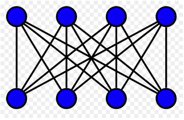
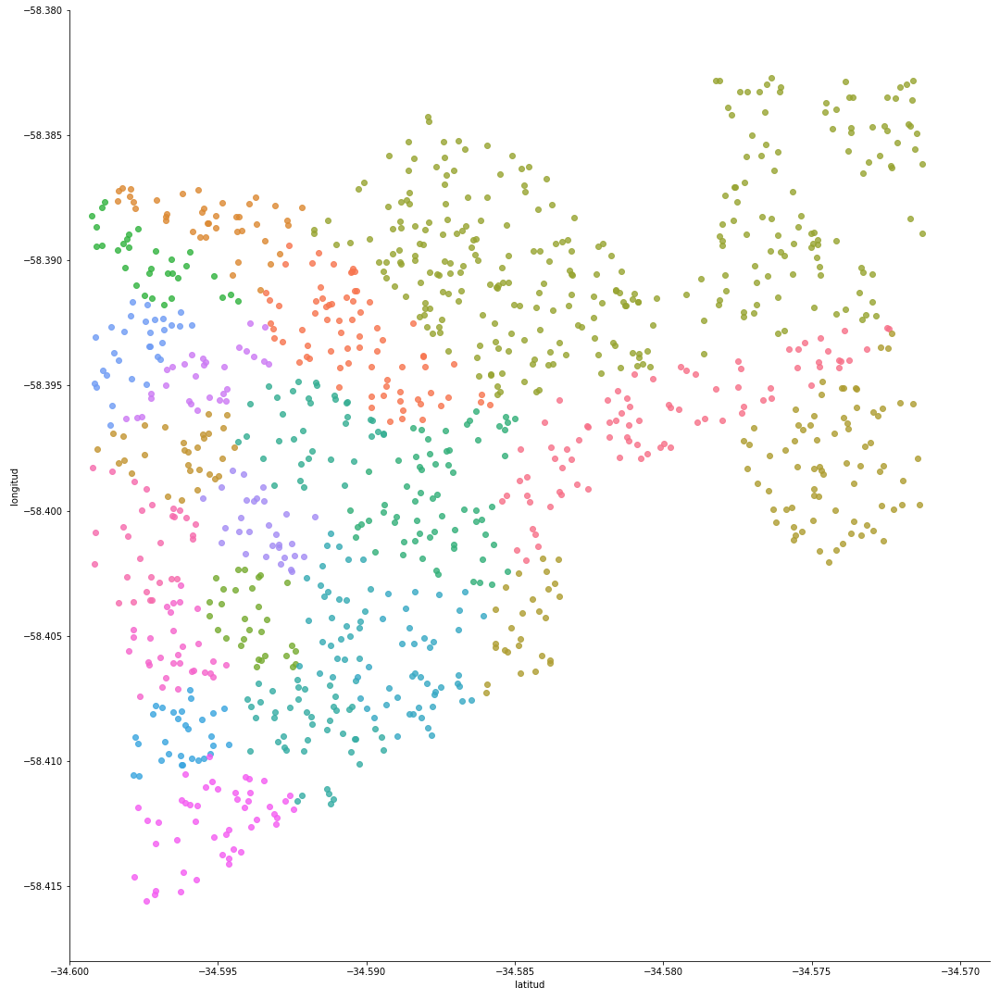
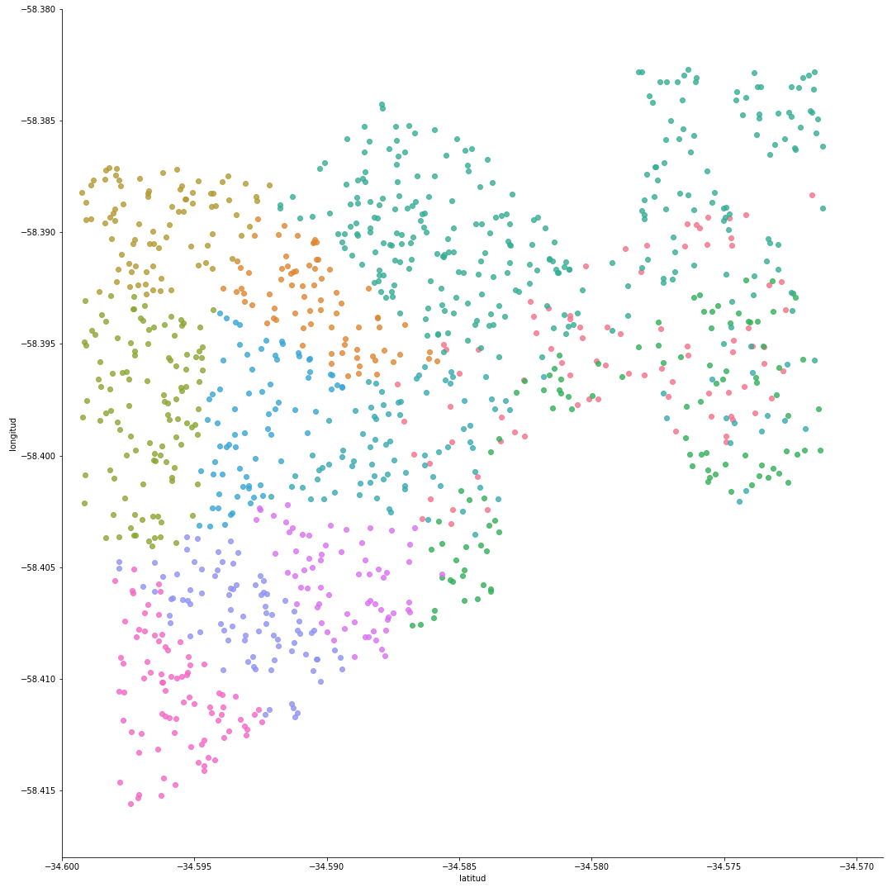
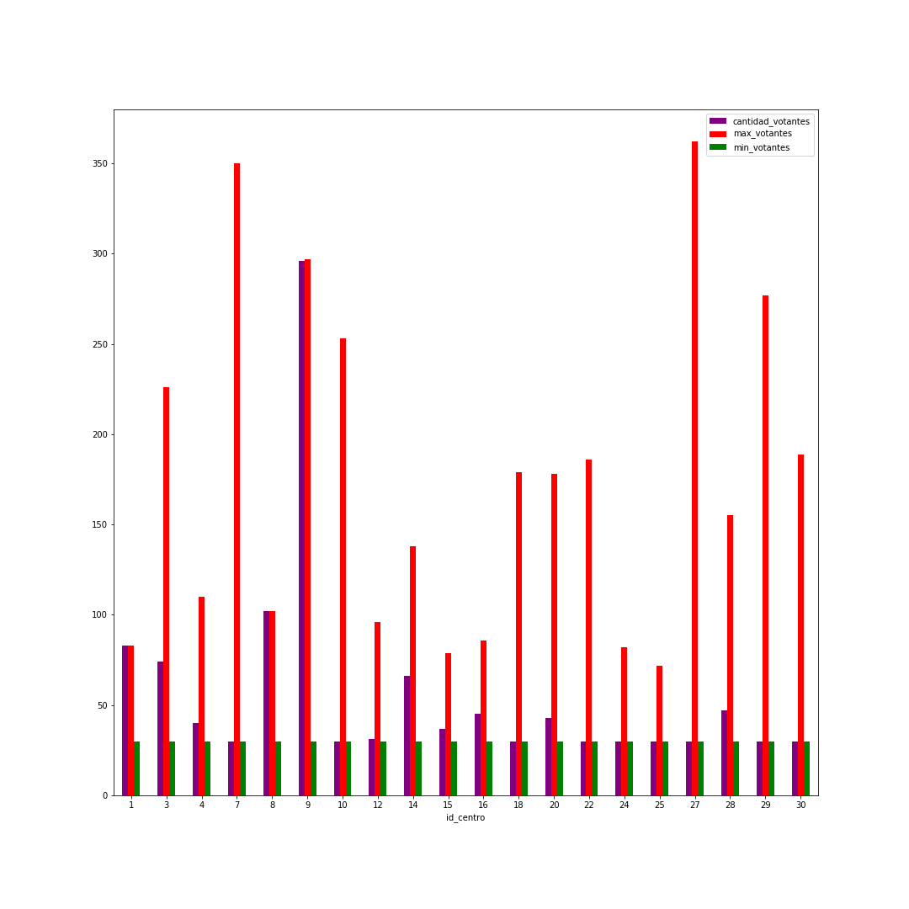
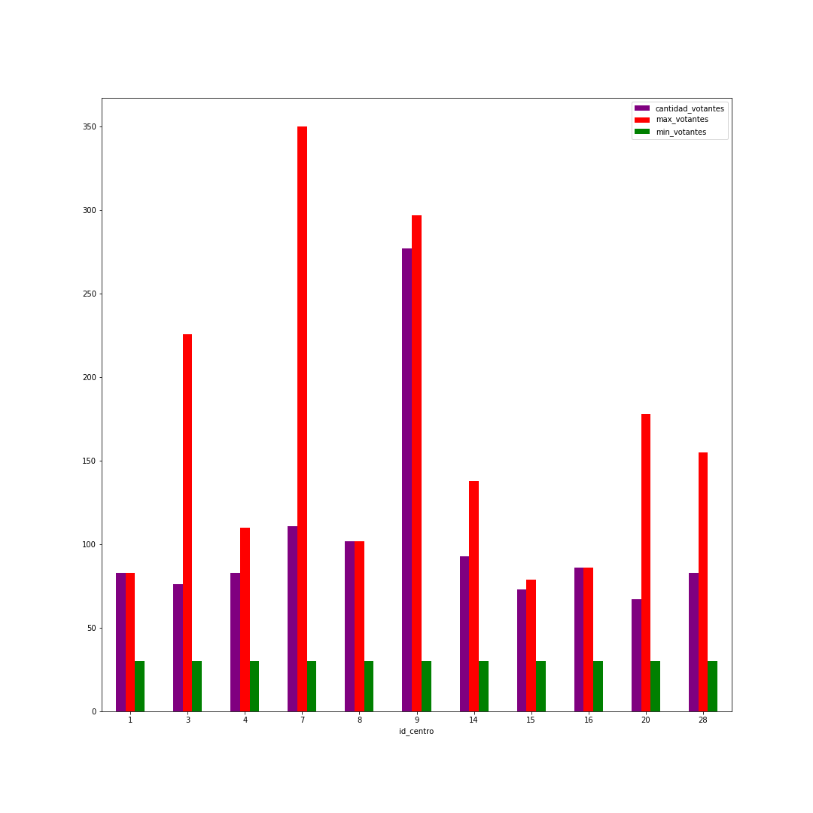
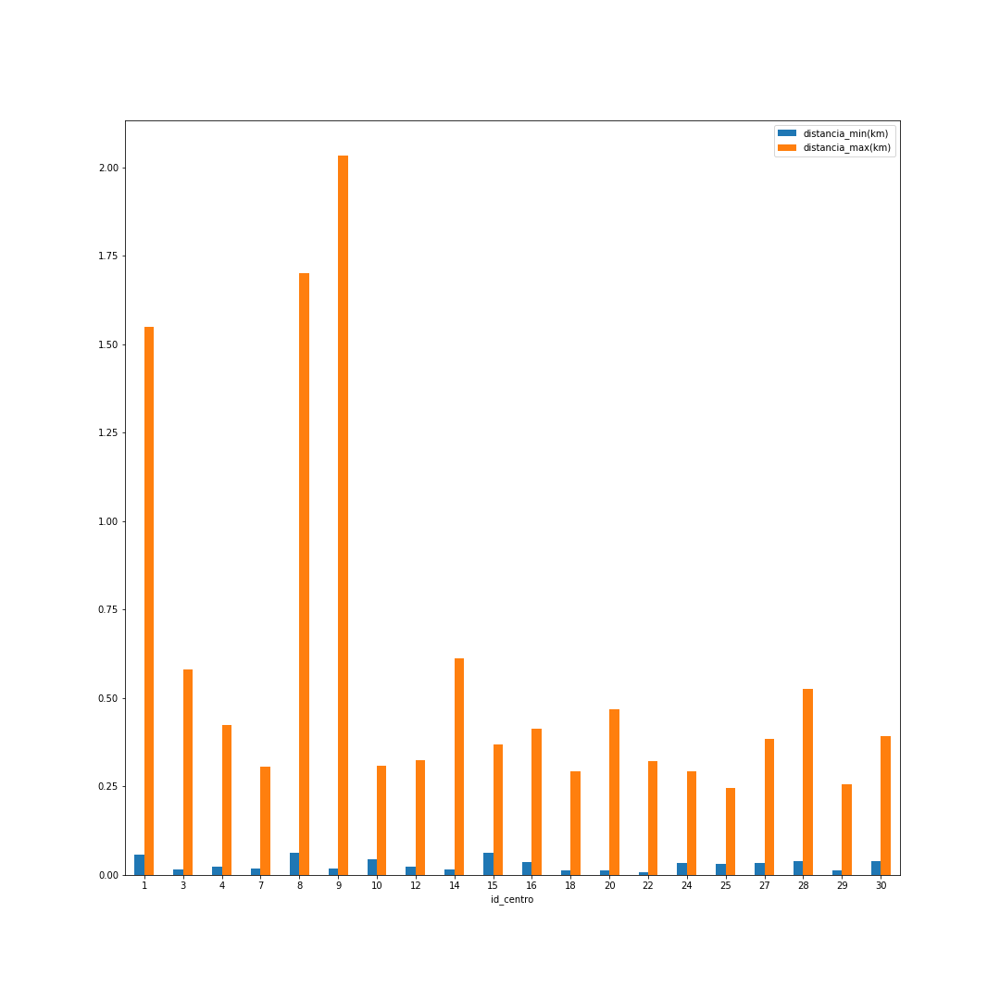
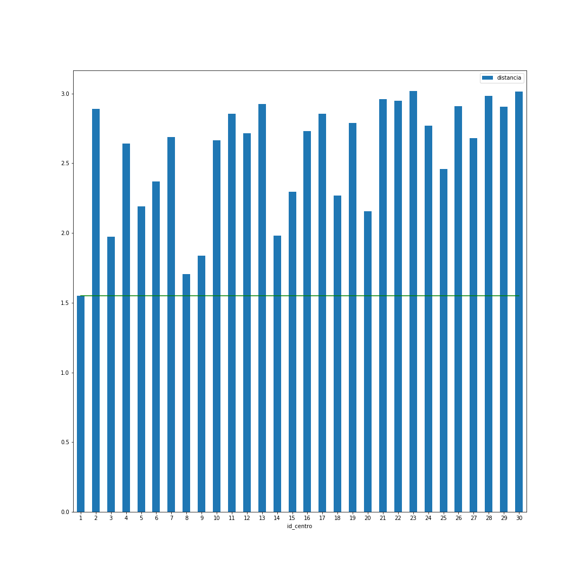
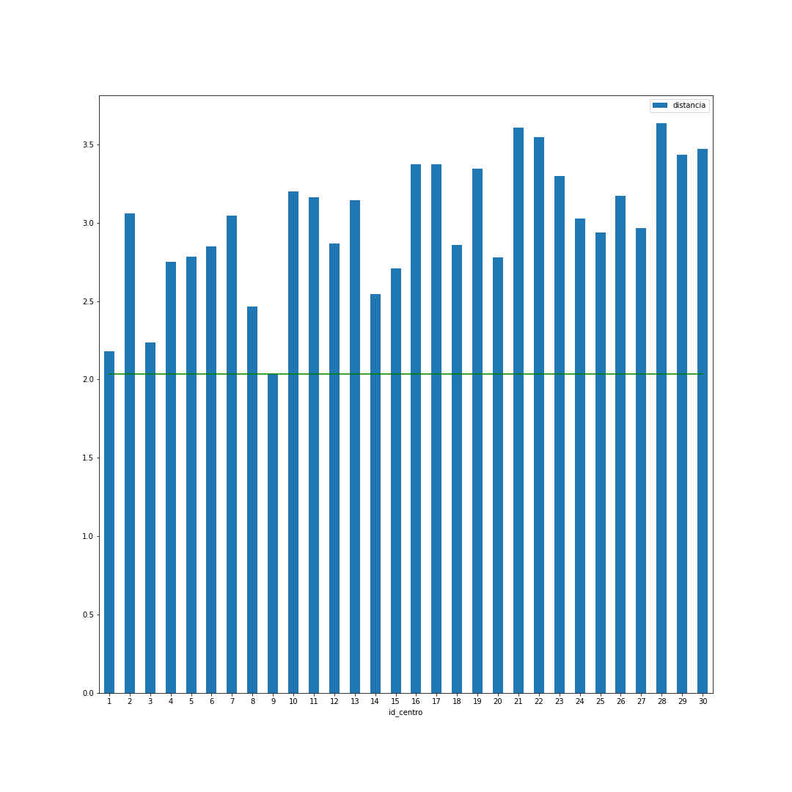

## Enunciado provisto

_Debido a las recurrentes quejas de los votantes por las distancias que deben recorrer desde sus domicilios hasta los lugares de votación, la Dirección Nacional Electoral desea rever la forma en que se asignan los ciudadanos a las mesas de votación. Se realizará una prueba piloto en un circuito electoral de la Ciudad de Buenos Aires._

## Análisis de la situación problemática

El tipo de problema detectado es de asignación ya que consiste en encontrar la forma de asignar ciertos recursos disponibles (votantes) para la realización de determinadas tareas al menor costo (distancia de cada votante al centro de votación). Se puede pensar en forma gráfica como un grafo bipartito, expuesto en la _Figura 1_, en el que los puntos superiores serían los votantes y los inferiores los cupos asignados en los centros de votación.

{ width=250px }

## Objetivo

Se busca aplicar y elaborar una heurística de construcción para encontrar una solución al problema sin que sea necesariamente la óptima. La lógica a seguir intenta minimizar la distancia de los votantes a los centros de votación y a su vez evitar una distribución que perjudique en exceso a un sector del circuito electoral, es decir, con el objetivo de que el algoritmo sea lo más justo y óptimo posible.

## Hipótesis y Supuestos

- La votación debe realizarse en un único día para asegurar la transparencia electoral, por lo que la disponibilidad por centro es máxima y no puede reutilizarse.
- No hay restricciones respecto al tiempo que tarda un votante en ir al centro de votación o en votar.
- No hay restricciones respecto a la distancia máxima que debe recorrer un votante en tanto cada circuito electoral tiene distinta área por la densidad demográfica de la región. 
- Se conoce la distancia de cada votante a todos los centros de votación.
- Los votantes tomarán el camino que consideren más corto para ir a votar.
- Los votantes conocerán el camino más corto a su respectivo centro de votación.
- Hay suficiente capacidad entre todos los centros dentro del circuito para recibir a todos los votantes de dicho circuito.
- Las capacidades de los centros de votación son constantes conocidas y varían circuito a circuito.
- El domicilio registrado de los votantes se mantiene por todo el proceso electoral.
- Cada persona se encuentra en su domicilio legal al momento de salir hacia su centro de votación asignado.
- La vuelta a casa del votante no es tenida en cuenta en el modelo planteado.
- No se tendrá en cuenta las condiciones físicas de los votantes.
- Hay libertad de asignar cualquier apellido a cualquier centro de votación. No es necesario mantener el _status quo_.
- Los votantes se mueven desde la puerta de su domicilio hasta la puerta del centro de votación sin ningún desvío. No se pueden tomar un colectivo que los deje a 2 cuadras.
- Cada votante se asigna a un único centro de votación (ocupa un único cupo).
- Los cupos de votantes no son reutilizables.
- Todo votante deberá ser asignado a un centro de votación. 
- Las elecciones son obligatorias.
- No se tomará en cuenta la asignación de votantes a sus respectivas mesas sino a su centro de votación.
- Los centros de votación requieren de una cantidad mínima de votantes asignados para ser abiertos.
- No hay restricciones respecto al presupuesto asignado a la votación.
- No hay restricciones respecto al costo de traslado de un votante al centro de votación.
- Todos los centros cuentan con una disponibilidad máxima. 
- Los presidentes de mesa o fiscales disponibles son infinitos en tanto se puede convocar a cualquier ciudadano por ley. El único limitante es la capacidad máxima del establecimiento. 
- Los votantes siempre tendrán un medio de transporte para ir a votar.
- Todos los votantes tienen la misma dificultad en recorrer la misma distancia. Por ejemplo: a un ciudadano A le es igual de difícil recorrer n metros que a ciudadano B, sin importar el valor de n.
- Se consideran votantes a las personas de 16 a 18 años empadronadas y a todos los mayores de 18.
- La métrica utilizada para calcular las distancias es la de Vincenty.
- Las unidad de medición para las distancias es de kilómetros. 

## Heurística elegida

En un primer lugar es necesario establecer una métrica bajo la cual se establecerá el criterio de que un votante está asignado de manera justa y a su vez óptima. Para eso se pensó que era necesario tener en cuenta la distancia, pero a su vez aplicar una penalidad para los que estaban siendo asignados a un centro muy lejano. Se decidió entonces tener en cuenta tanto la distancia de un votante a su centro como dicha distancia al cuadrado ya que de esta manera se refleja la penalidad descrita anteriormente.

Para poder cumplir con el objetivo planteado en la entrega se pensó seguir un algoritmo de tipo **greedy** en el sentido en que se busca el óptimo local: asignar cada votante a su centro más cercano. En caso de que halla dos centros a igual distancia, se asigna al centro con menor id. A su vez, se deben tener en cuenta los requisitos de que un centro necesita una capacidad mínima para ser abierto y una capacidad máxima que debe respetar. Para ello se decidió asignar votantes a un centro de manera de no exceder su capacidad, por lo que nunca el algoritmo abrirá un centro con una capacidad mayor a su capacidad máxima. Así mismo, es probable que en una primera asignación algunos centros tengan menos votantes que su capacidad mínima. Por lo tanto se decidió realizar una segunda asignación de los votantes que estén asignados en esas condiciones a centros que tengan cubierta su capacidad mínima y que a su vez no excedan su capacidad máxima con esta nueva asignación.

Un problema detectado para esta heurística radica en el caso en que en esta segunda asignación un votante no pueda ser asignado a ningún centro ya que todos tienen tantos votantes como su capacidad máxima. Para solventar esta situación podría haberse planteado otra heurística en la que se detecten ciertos **clusters** de votantes siguiendo un criterio determinado ya que nunca se llegaría a este caso.

## Pseudocódigo de la heurística elegida

```
1. Por cada votante del circuito electoral:
  1.1 Se ordenan las distancias(*) a cada centro
  1.2 Se obtiene el centro que esté a menor distancia
  1.3 Si el centro no excede la capacidad máxima con esta asignación:
      1.3.1 Se asigna
  1.4 Caso contrario:
      1.4.1 Se vuelve al paso 1.2, esta vez obteniendo el siguiente centro
2. Por cada centro del circuito electoral:
  2.1 Si la cantidad de votantes asignados es menor a la capacidad mínima:
    2.1.1 Por cada votante asignado a ese centro:
      2.1.1.1 Se ordenan las distancias(*) a cada centro
      2.1.1.2 Se obtiene el centro que esté a menor distancia
      2.1.1.3 Si el centro no excede la capacidad máxima con esta asignación y cumple la capacidad
      mínima:
        2.1.1.3.1 Se asigna
      2.1.1.4 Caso contrario:
        2.1.1.4.1 Se vuelve al paso 2.1.1.2, esta vez obteniendo el siguiente centro

(*) Las distancias se calculan como la suma entre la distancia del votante a su centro y su cuadrado
```

## Código de la heurística elegida

Se encuentra en la carpeta entregada bajo el nombre de `heuristica.html` o `heuristica.ipynb` para verlo en formato de Jupyter Notebook.

## Análisis de los resultados

Una vez obtenido el resultado arrojado por el software se hizo un análisis de datos del mismo, similar al que se realizó en la entrega anterior para poder establecer una comparación entre ambos resultados y así poder analizar la heurística adoptada. El código utilizado para la realización de los gráficos se encuentra en `generador_graficos_modelo.ipynb` para los gráficos del modelo y `generador_graficos_heuristica.ipynb` para los gráficos relativos a la heurística.

El primer gráfico realizado expone a los votantes como puntos en sus respectivas coordenadas. El color utilizado para dibujar cada elemento representa la asignación de cada votante a cada centro.

Se puede observar a grandes rasgos que la cantidad de centros abiertos con el resultado obtenido con la heurística es menor. Esto resulta lógico por el procedimiento a seguir, en un primer lugar se realiza una asignación y luego se decide reducir la cantidad de centros a abrir si hay centros que no cumplen con la capacidad mínima. Además, esta reasignación no se realiza a los votantes de los centros que ya cumplen la capacidad mínima por lo que necesariamente la cantidad de centros a abrir después de este segundo paso de asignación es menor o igual, siendo para este dataset menor.

Por el mismo motivo mencionado anteriormente es que algunos votantes son asignados a centros más lejanos. Mientras que en el resultado arrojado por el modelo se ven clusters de votantes de colores marcados, en el caso de la heurística se observan puntos de colores mezclados. Esta reasignación va a provocar que los votantes que no puedan ser asignados al centro de color turquesa deban asignarse a un centro más lejano pero que cumpla con la capacidad mínima, provocando esta distribución que parece menos óptima pero que será analizada posteriormente.

{ width=350px }

{ width=350px }

\newpage

A continuación se verificó que las restricciones basicas estén cumplidas tanto para el modelo como para la heurística. Para lograrlo se graficó la cantidad de votantes por centro (violeta), la capacidad máxima (rojo) y la cantidad de gente mínima para abrir el centro (verde). Como se puede ver en los gráficos a continuación, se verifica que todos los centros contienen una cantidad de gente asignada mayor a la capacidad mínima del centro y menor a la capacidad máxima tanto en la heurística como en el modelo. Así mismo, se verifica que la cantidad de centros abiertos con la heurística (11) es menor a la de los abiertos con el modelo (20). Algo interesante a destacar es que con la heurística se abren centros que se abren también con el modelo y a su vez no se abre ningún centro que en la solución óptima se halla descartado. Por lo tanto, se asignan más votantes a esos centros en la heurística que el modelo, lo cual resulta evidente ya que todos los votantes deben ser asignados.

{ width=350px }

{ width=350px }

\newpage

Además, se evaluó la equitatividad de la solución conseguida. Para ello se analizó la diferencia entre el votante más lejano y más cercano asignados a cada centro: 

{ width=250px }

A primera vista podría suponerse que las asignaciones a los centros 1, 8 y 9 no eran del todo justas. Por lo tanto el siguiente paso fue intentar decifrar cómo se realizaba la asignación en estos 3 centros para los votantes más lejanos. Se pensó que el votante más lejano a cada centro está más lejos aún del resto de los centros (o la mayoría de ellos). Para verificar esta teoría se tomó el votante más lejano de cada centro y se graficó la distancia que tiene el mismo al resto de los centros (representada por barras) y la distancia que tendrá que recorrer para ir al centro que fue asignado (linea).

{ width=250px }

{ width=250px }

{ width=250px }

\newpage

Luego de analizar estos tres gráficos se llegó a una conclusión. Por un lado pareciera inequitativo que halla votantes tan lejanos a su centro de votación en comparación a otros votantes de su mismo centro. Por el otro, si estos votantes fueran asignados a otro centro sería mayor la distancia. Estonces, se entiende que fueron asignados de una forma justa y óptima.
